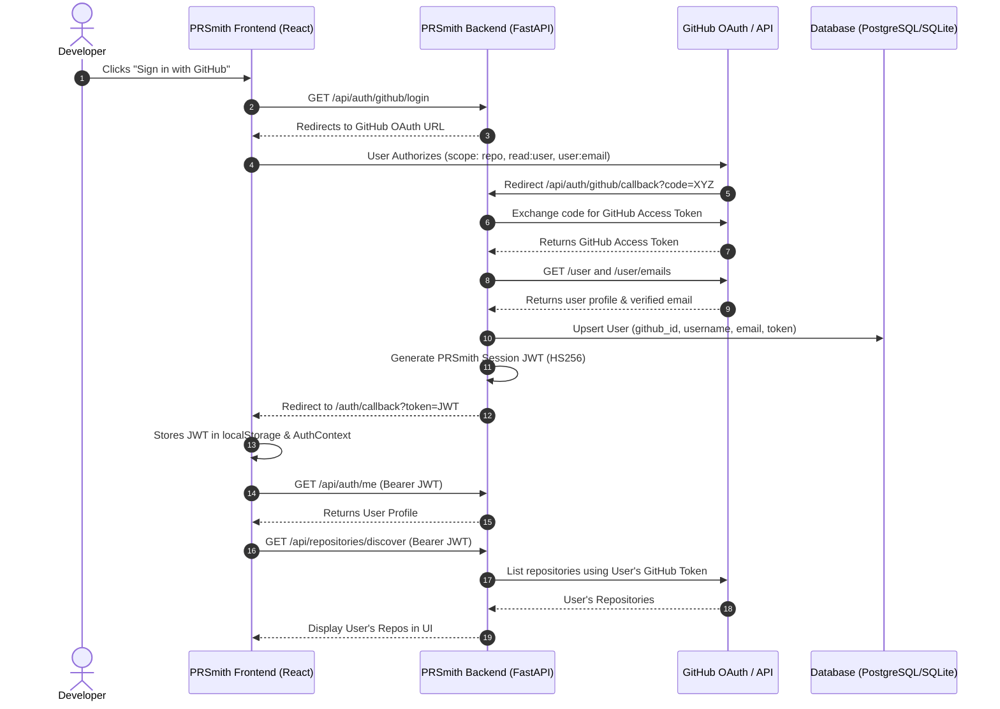

# Sign in with GitHub & User Repository Management

Add complete GitHub OAuth authentication to PRSmith so any user can sign in with their GitHub account, discover and manage their personal and organization repositories, build AST Knowledge Graphs, and run autonomous pull request reviews.

## User Review Required

> [!IMPORTANT]
> **GitHub OAuth App Setup Required**:
> To test GitHub Sign-In in production or local development, a GitHub OAuth App (or GitHub App with OAuth enabled) is needed with:
> - **Client ID** (`GITHUB_CLIENT_ID`)
> - **Client Secret** (`GITHUB_CLIENT_SECRET`)
> - **Authorization Callback URL**: `http://localhost:8000/api/auth/github/callback` (or `http://localhost:3000/auth/callback`)
>
> We will also ensure a fallback mechanism to `GITHUB_PAT` exists so that existing single-tenant development remains 100% functional even when OAuth credentials are not yet configured in `.env`.

> [!NOTE]
> As requested, we will also create a dedicated Python virtual environment (`.venv`) and install all required project dependencies.

---

## Proposed Changes

---

### 1. Environment & Setup

#### [NEW] [Virtual Environment](file:///c:/Users/gungu/PRSmith---Autonomous-Pull-Request-Agent-/.venv)
- Create dedicated `.venv` using Python 3.11.
- Install project dependencies (`fastapi`, `pydantic-settings`, `sqlalchemy`, `PyJWT`, `httpx`, `pytest`, `pytest-asyncio`, etc.).

---

### 2. Backend Authentication & Database

#### [MODIFY] [backend/config.py](file:///c:/Users/gungu/PRSmith---Autonomous-Pull-Request-Agent-/backend/config.py)
- Add `FRONTEND_URL: str = "http://localhost:3000"`
- Add `JWT_ALGORITHM: str = "HS256"`
- Add `ACCESS_TOKEN_EXPIRE_MINUTES: int = 10080` (7 days)
- Ensure `GITHUB_CLIENT_ID` and `GITHUB_CLIENT_SECRET` configuration settings are fully integrated.

#### [MODIFY] [backend/database/models.py](file:///c:/Users/gungu/PRSmith---Autonomous-Pull-Request-Agent-/backend/database/models.py)
- Update `User` model:
  - Add `github_access_token: Mapped[Optional[str]] = mapped_column(Text, nullable=True)`
  - Add `updated_at: Mapped[datetime] = mapped_column(DateTime, default=utcnow, onupdate=utcnow)`
  - Add `repositories: Mapped[List["Repository"]] = relationship("Repository", back_populates="user")`
- Update `Repository` model:
  - Add `user_id: Mapped[Optional[str]] = mapped_column(String(36), ForeignKey("users.id", ondelete="SET NULL"), nullable=True)`
  - Add `user: Mapped[Optional["User"]] = relationship("User", back_populates="repositories")`

#### [NEW] [backend/auth/security.py](file:///c:/Users/gungu/PRSmith---Autonomous-Pull-Request-Agent-/backend/auth/security.py)
- Implement `create_access_token(payload: dict, expires_delta: Optional[timedelta] = None) -> str`
- Implement `decode_access_token(token: str) -> Optional[dict]`
- Implement `get_current_user` FastAPI dependency (extracts Bearer token from header, decodes user, loads `User` from DB).
- Implement `get_current_user_optional` FastAPI dependency (supports both authenticated users and optional dev fallback).

#### [NEW] [backend/api/auth.py](file:///c:/Users/gungu/PRSmith---Autonomous-Pull-Request-Agent-/backend/api/auth.py)
- `GET /api/auth/github/login`: Builds GitHub OAuth URL with state param.
- `GET /api/auth/github/callback`: Exchanges code for access token, fetches profile from GitHub API, creates/updates `User` in DB, generates PRSmith session JWT, and redirects to `${FRONTEND_URL}/auth/callback?token=${jwt}`.
- `GET /api/auth/me`: Returns current authenticated user object (`id`, `username`, `email`, `avatar_url`, `role`).
- `POST /api/auth/logout`: Cleans up active session.

#### [MODIFY] [backend/app.py](file:///c:/Users/gungu/PRSmith---Autonomous-Pull-Request-Agent-/backend/app.py)
- Include `auth_router` in FastAPI application (`/api/auth`).
- Update database auto-migration in `lifespan` to add `github_access_token` to `users` and `user_id` to `repositories` if missing.

---

### 3. User-Scoped Repository Discovery & Operations

#### [MODIFY] [backend/api/repositories.py](file:///c:/Users/gungu/PRSmith---Autonomous-Pull-Request-Agent-/backend/api/repositories.py)
- Update `discover_github_repos`:
  - If a user is logged in, use `user.github_access_token` to fetch their personal & org repositories from GitHub.
  - If no user is logged in, gracefully fallback to `settings.GITHUB_PAT` (if configured), or return 401 with instruction to sign in.
- Update `register_repository`:
  - Fetch repo metadata using the user's GitHub token (or fallback PAT).
  - Associate `repo.user_id = user.id`.
- Update `list_open_prs`:
  - Use user's GitHub token or fallback PAT.

---

### 4. Frontend Authentication & UI

#### [NEW] [frontend/src/context/AuthContext.tsx](file:///c:/Users/gungu/PRSmith---Autonomous-Pull-Request-Agent-/frontend/src/context/AuthContext.tsx)
- React Auth Context providing:
  - `user: UserProfile | null`
  - `token: string | null`
  - `isAuthenticated: boolean`
  - `loading: boolean`
  - `login(): void` (redirects to GitHub OAuth)
  - `logout(): void`
  - `handleOAuthToken(token: string): Promise<void>`

#### [MODIFY] [frontend/src/api/client.ts](file:///c:/Users/gungu/PRSmith---Autonomous-Pull-Request-Agent-/frontend/src/api/client.ts)
- Add Axios request interceptor to automatically attach `Authorization: Bearer <token>` from `localStorage`.
- Add API functions: `fetchCurrentUser()`, `getGitHubAuthUrl()`, `logoutUser()`.
- Add `UserProfile` TypeScript interface.

#### [NEW] [frontend/src/pages/AuthCallback.tsx](file:///c:/Users/gungu/PRSmith---Autonomous-Pull-Request-Agent-/frontend/src/pages/AuthCallback.tsx)
- Handles `/auth/callback` route after GitHub redirect.
- Extracts `token`, saves to storage, fetches profile, and redirects to `/repos`.

#### [NEW] [frontend/src/components/UserMenu.tsx](file:///c:/Users/gungu/PRSmith---Autonomous-Pull-Request-Agent-/frontend/src/components/UserMenu.tsx)
- Sleek profile component displaying GitHub avatar, handle, role, and a dropdown with "Sign Out".
- When unauthenticated, displays modern "Sign in with GitHub" button with GitHub mark.

#### [MODIFY] [frontend/src/App.tsx](file:///c:/Users/gungu/PRSmith---Autonomous-Pull-Request-Agent-/frontend/src/App.tsx)
- Wrap application with `AuthProvider`.
- Add `/auth/callback` route.
- Mount `UserMenu` in Topbar and Sidebar.

#### [MODIFY] [frontend/src/pages/RepositoryHub.tsx](file:///c:/Users/gungu/PRSmith---Autonomous-Pull-Request-Agent-/frontend/src/pages/RepositoryHub.tsx)
- Display user context in Repository Hub:
  - When signed in: "Showing repositories for **@username**"
  - When not signed in: Banner prompting user to "Sign in with GitHub to view and track your personal and organization repositories."

#### [MODIFY] [frontend/src/index.css](file:///c:/Users/gungu/PRSmith---Autonomous-Pull-Request-Agent-/frontend/src/index.css)
- Add polished styling for UserMenu, GitHub Sign-in buttons, avatar badges, OAuth callback animation, and auth banners.

---

## Verification Plan

### Automated Tests
1. **Virtual Environment Verification**:
   - Verify `.venv` creation and package installation.
2. **Backend Auth Unit & Integration Tests**:
   - `tests/unit/test_auth_security.py`: Test JWT generation, expiration, and decoding.
   - `tests/integration/test_auth_endpoints.py`: Test `/api/auth/github/login`, `/api/auth/me`, and `/api/repositories/discover` with mock tokens.
   - Run tests via `.venv/Scripts/pytest`.
3. **Frontend Build & Lint**:
   - Run `npm run build` in `frontend/` to verify zero TypeScript or bundle errors.

### Manual Verification
1. Verify "Sign in with GitHub" button appears in the UI (topbar/sidebar).
2. Verify clicking "Sign in with GitHub" directs to the GitHub OAuth authorization page with the correct `client_id` and scopes (`repo`, `read:user`, `user:email`).
3. Verify `/auth/callback` sets token, displays user avatar/username in topbar.
4. Verify "Add Repository" loads repositories belonging to the authenticated GitHub user.
5. Verify "Sign Out" cleanly clears auth state.
