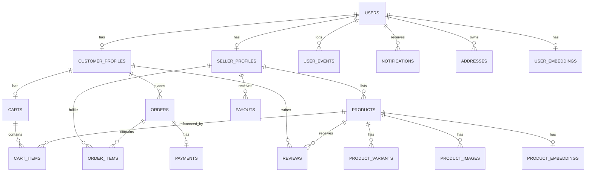

# 🧠 Vyapari — Engineering Memory & System Decisions

> **Status**: Active Living Context  
> **Last Updated**: August 2026  
> **Repository**: `Vyapari-Autonomous-E-Commerce-Operations-Personalization-Platform`  
> **Authors**: DeepMind AI Coding Agent & Engineering Team

---

## 📌 1. Project Purpose & Scope

Vyapari is an autonomous e-commerce operations and personalization platform designed for the Indian marketplace. The system balances two core personas:
1. **Buyers (Customers)**: Streamlined, high-trust storefront with sub-second catalog navigation, cart management, checkout with Razorpay INR payments, order tracking, and personalized recommendations.
2. **Sellers (Vyaparis)**: Autonomous operations portal featuring KYC verification, inventory and variant management, order fulfillment state updates, and real-time revenue analytics.
3. **Admins**: Central moderation portal with KYC document verification queues and seller status overrides.

---

## 🏛️ 2. Architectural Decisions & Rationale (ADRs)

### ADR-001: Modular Monolith with FastAPI + Async SQLAlchemy 2.0
- **Decision**: Build the backend as a single FastAPI service organized into domain modules (`auth`, `customer`, `seller`, `admin`, `ml`) rather than early microservices.
- **Rationale**: Keeps database transactions unified and development velocity high. Async IO (`asyncpg`, `httpx`, `asyncio`) ensures high concurrency for concurrent product searches and checkout operations without the operational overhead of multiple deployable units.

### ADR-002: Day-1 AI/ML Data Schemas & pgvector Integration
- **Decision**: Provision `product_embeddings`, `user_embeddings`, `user_events`, and `model_registry` tables into the primary PostgreSQL 16 database from Day 1, even while using rule-based fallbacks at MVP.
- **Rationale**: Eliminates painful data backfilling and schema migrations when transitioning from MVP to machine learning models (e.g., `sentence-transformers/all-mpnet-base-v2`).
- **Vector Abstraction**: `VectorStoreService` wraps all vector similarity operations (`<=>` cosine, `<->` L2) so migrating to external vector databases (Pinecone, Qdrant) in the future requires modifying only one service file.

### ADR-003: Two-Canvas UI Design System (`DESIGN.md`)
- **Decision**: Explicitly bifurcate the frontend into two design canvases:
  - **Cinematic Dark (`#000000`)**: Landing page hero, marketing, category showcases, and footers.
  - **Transactional Cream/Light (`#fbfbf5` / `#ffffff`)**: Search, product grids, checkout, auth, and dashboards.
- **Typography Decision**: Inter Display and Inter Variable with OpenType `font-feature-settings: "ss03"` (replacing licensed Neue Haas Grotesk Display) to maintain a refined, editorial aesthetic with zero licensing barriers.
- **CSS Strategy**: Pure CSS custom properties (tokens) + CSS Modules instead of Tailwind CSS. Gives exact, pixel-perfect control over typography line-heights, letter-spacing, and custom color variables.

### ADR-004: Razorpay INR-First Payment Architecture
- **Decision**: Standardize all payment operations on Razorpay with amount calculations strictly in **paise** (`₹1 = 100 paise`).
- **Security Invariant**: Client-side payment responses are never trusted. All transactions require server-side HMAC-SHA256 signature verification (`razorpay_order_id|razorpay_payment_id` against `RAZORPAY_KEY_SECRET`) before changing an order's status to `confirmed`.

### ADR-005: Strict Seller KYC Gate
- **Decision**: Sellers can register and explore their dashboard immediately, but the API rejects any attempt to create or publish products if `SellerProfile.kyc_status != KYCStatus.approved`.
- **Validation**: Regex patterns validate Indian tax and business identifiers (`GSTIN`: `^\d{2}[A-Z]{5}\d{4}[A-Z]{1}\d[Z]{1}[A-Z\d]{1}$`, `PAN`: `^[A-Z]{5}\d{4}[A-Z]{1}$`).

### ADR-006: Soft Archiving for Products
- **Decision**: Product deletion endpoints set `Product.status = ProductStatus.archived` rather than executing SQL `DELETE`.
- **Rationale**: Preserves foreign key integrity across historical `order_items`, `cart_items`, reviews, and analytics.

---

## 🗄️ 3. Data Model & Entity Relations Overview



### Table Summary:
1. **`users`**: Central authentication entity (email, password hash, role enum, Google sub ID, verification status).
2. **`customer_profiles`**: Preferences, full name, customer-specific settings.
3. **`seller_profiles`**: Business name, store metadata, GSTIN, PAN, bank details (JSONB), KYC status (`pending`, `under_review`, `approved`, `rejected`), rejection reason.
4. **`products`**: Name, slug (auto-generated URL-safe identifier), description, brand, price, stock quantity, status (`draft`, `active`, `archived`), seller ID.
5. **`product_variants`**: SKU, price delta, variant attributes (`{"size": "XL", "color": "Navy"}`), stock quantity.
6. **`product_images`**: Image URL, alt text, sort order, primary flag.
7. **`carts` & `cart_items`**: User cart with variant support and `saved_for_later` toggle.
8. **`orders` & `order_items`**: Immutable order snapshot containing frozen address data, pricing, coupon code, tracking number, logistics provider, and fulfillment status.
9. **`payments`**: Razorpay transaction tracking (gateway order ID, payment ID, status, raw response).
10. **`reviews`**: 1–5 star rating, verified purchase badge, comment, image gallery, uniqueness constraint (`product_id + customer_id`).
11. **`product_embeddings` & `user_embeddings`**: pgvector 768-dim float arrays with model version tracking.
12. **`user_events`**: Append-only clickstream (`view`, `click`, `cart_add`, `wishlist_add`, `purchase`, `search`).
13. **`model_registry`**: ML deployment metadata and metrics (`accuracy`, `ndcg@10`).
14. **`notifications`**: User alerts for orders, KYC updates, low-stock, and promotional messages.

---

## 🔒 4. Security & Role-Based Access Control (RBAC)

### Role Hierarchy:
- `admin`: Unrestricted access across all endpoints, including KYC approval/rejection.
- `seller`: Access to `/api/v1/seller/*` endpoints. Product creation is KYC-gated.
- `customer`: Access to cart, checkout, customer orders, and product review submissions.

### Dependency Implementations:
- `CurrentUserDep`: Extracts and verifies JWT from `Authorization: Bearer <token>` or cookies.
- `RequireRole("customer" | "seller" | "admin")`: Enforces role-based permissions in FastAPI routes.

### Password Policy:
- Minimum 8 characters.
- Must contain at least one uppercase letter and at least one numeric digit (enforced by Pydantic validators).

---

## 🔄 5. State Machines & Workflow Invariants

### A. Order Fulfillment Lifecycle
```text
pending ─────────► confirmed ─────────► processing ─────────► shipped ─────────► delivered
   │                   │
   ▼                   ▼
cancelled           cancelled
```
- **Stock Reservation**: On `checkout`, product `stock_qty` is decremented atomically.
- **Cancellation**: Permitted only in `pending` or `confirmed` states.

### B. Seller KYC Lifecycle
```text
pending ─────────► under_review ─────────► approved (Unlocks product listing)
                         │
                         ▼
                      rejected (Stores rejection reason for seller correction)
```

### C. Payment Lifecycle (Razorpay)
```text
pending ─────────► captured (Verified via HMAC-SHA256)
   │
   ▼
 failed / refunded
```

---

## ⚙️ 6. Celery Background Tasks & Periodic Jobs

- **Worker Configuration**: Redis broker and backend (`redis://localhost:6379/0`), IST timezone (`Asia/Kolkata`).
- **`app.tasks.notifications`**:
  - `send_order_confirmation_email`: Generates formatted HTML receipt and sends via SendGrid (3 retries with exponential backoff).
  - `send_kyc_status_email`: Notifies sellers of KYC approval or rejection reason.
- **`app.tasks.embedding_refresh`** (Celery Beat Scheduled):
  - `refresh_all_product_embeddings`: Scheduled every 24 hours (`86400s`).
  - `refresh_user_embeddings`: User event preference vector recalculation.

---

## 🖥️ 7. Frontend Pages & Routes

| Route | Canvas Mode | Key Features |
| :--- | :--- | :--- |
| `/` | **Cinematic Dark** | Hero with dual CTA cards, live stats counter, category pills, features grid, seller band, dark footer |
| `/customer/home` | **Transactional Light** | Sticky search bar, category filter, trending products, responsive product cards |
| `/customer/login` | **Transactional Cream** | Google OAuth2 + Email/password sign-in, error handling |
| `/customer/signup` | **Transactional Cream** | Two-step registration progress bar |
| `/seller/login` | **Transactional Cream** | Seller portal authentication |
| `/seller/signup` | **Transactional Cream** | 3-step onboarding with business details and KYC pending screen |
| `/seller/dashboard` | **Transactional Cream** | Sticky sidebar, 30-day revenue analytics, top products table, KYC alert |
| `/admin/dashboard` | **Transactional Light** | Real-time KYC moderation queue with Approve/Reject actions |

---

## 🧪 8. Testing & Verification

- **Test Framework**: `pytest` + `pytest-asyncio` + `httpx`.
- **Database Fixture**: In-memory SQLite (`sqlite+aiosqlite:///:memory:`) initialized with full `Base.metadata.create_all`.
- **Test Scenarios Verified**:
  - Customer signup (success, duplicate email collision, weak password validation).
  - Seller signup (success, business profile creation).
  - Authentication login (valid credentials, invalid password).
  - JWT token refresh mechanism.
- **Frontend Verification**: Production build validation (`next build` with Turbopack) passing with 0 TypeScript/ESLint errors.

---

## 🗺️ 9. Roadmap & Post-MVP Milestones

- [ ] **Phase 1: Real ML Embeddings**: Swap `StubEmbedder` with `SentenceTransformerEmbedder` (`all-mpnet-base-v2`) in `app/ml/embeddings/product_embedder.py`.
- [ ] **Phase 2: Semantic Hybrid Search**: Integrate PostgreSQL `tsvector` keyword search with pgvector cosine distance ranking.
- [ ] **Phase 3: Automated Logistics**: Integrate Shiprocket / Delhivery API for live tracking updates via webhooks.
- [ ] **Phase 4: Multi-Vendor Split Payouts**: Automated Razorpay Route / Route X transfers for seller payouts.
